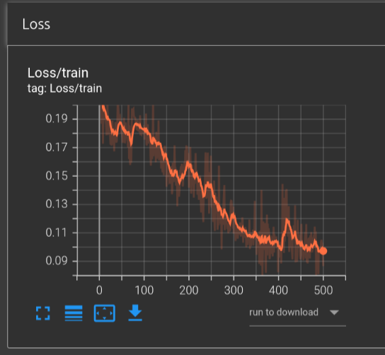
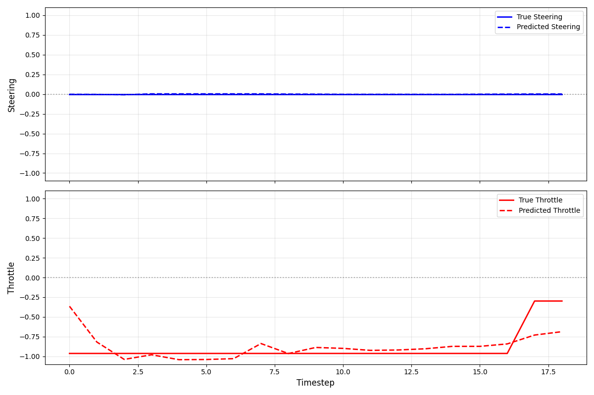

# 12/10

* Simplified policy for data collection
* Can learn if only a few samples, otherwise we don't know yet

* Trained for 500 epochs on 1000 transitions
    - 500 epochs is 10x what I was training with before, so maybe just train for longer?

* More data (100k transitions) is being collected with this policy
